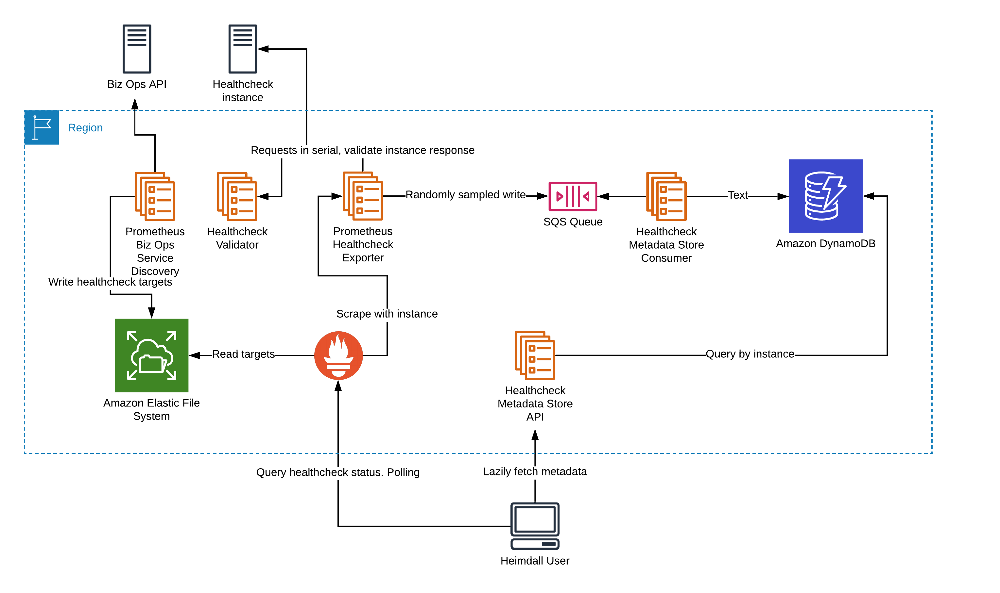

<!--
    Written in the format prescribed by https://github.com/Financial-Times/runbook.md.
    Any future edits should abide by this format.
-->

# Prometheus Biz Ops Service Discovery

A service which reads the Biz Ops API for FT healthchecks on a schedule, and writes a Prometheus service discovery configuration file to an EFS mount which the Monitoring Aggregation Prometheus reads to determine which healthcheck targets to scrape.

## Primary URL

N/A

## Service Tier

Platinum

## Lifecycle Stage

Production

## Host Platform

AWS ECS

## Delivered By

[reliability-engineering](https://biz-ops.in.ft.com/Team/reliability-engineering)

## Supported By

[reliability-engineering](https://biz-ops.in.ft.com/Team/reliability-engineering)

## First Line Troubleshooting

Check whether the [Amazon CloudWatch is available](https://status.aws.amazon.com/) or has any problems in regions the FT hosts alarms in.

The exporter can be accessed directly either via the [Dyn GSLB](https://prometheus-biz-ops-service-discovery.in.ft.com) or in the [EU](https://prometheus-biz-ops-service-discovery-eu-west-1.in.ft.com) or [US](https://prometheus-biz-ops-service-discovery-us-east-1.in.ft.com) specifically.

A few useful queries can be ran to determine what the exporter is returning, if anything. These can be run either in the [Prometheus console](http://prometheus.in.ft.com/) or the [Grafana explore UI](https://grafana.ft.com/explore?left=%5B%22now-6h%22,%22now%22,%22Operations%20%26%20Reliability%20Prometheus%22,%7B%7D,%7B%22ui%22:%5Btrue,true,true,%22none%22%5D%7D%5D).

The percentage of service discovery configuration writes which failed (this should be 0) can be fetched using the query

```promql
min(floor((rate(service_discovery_failures_total{system="prometheus-biz-ops-service-discovery"}[10m]) / on(system, region, instance) rate(service_discovery_writes_total{system="prometheus-biz-ops-service-discovery"}[10m])) * 100)) by (region)
```

View the generic troubleshooting information for the AWS ECS cluster (including services running on the cluster) which the application runs on: [monitoring-aggregation-ecs](https://github.com/Financial-Times/monitoring-aggregation-ecs/blob/master/documentation/RUNBOOK.md).

## Second Line Troubleshooting

The service discovery file is written to persistent storage (AWS EFS) so any failures in writing the file are not critical to the scraping of healthchecks providing the file still exists and is readable by Prometheus.]

It may be useful to view the latest targets Prometheus has read from the written config file using the targets interface for the [EU](https://prometheus-eu-west-1.in.ft.com/targets#job-health_check) and [US](https://prometheus-us-east-1.in.ft.com/targets#job-health_check) prometheus instances.

## Bespoke Monitoring

The Heimdall Prometheus has some bespoke alarms which are sent to the [#rel-eng-alerts](https://financialtimes.slack.com/messages/C8QL0GY9J) Slack via alertmanager.

These are visible in the [Alertmanager UI](https://alertmanager.in.ft.com/) if they are firing.

There are several Grafana dashboards:

-   [AWS ECS Task metrics](http://grafana.ft.com/d/YCsaeAFiz/aws-ecs-operations-and-reliability?orgId=1&var-region=eu-west-1&var-cluster=mon-agg-ecs&var-service=mon-agg-ecs-service-prometheus-biz-ops-service-discovery-Service-6YOWGDI4X619).
-   [Go language runtime metrics](http://grafana.ft.com/d/c0mUzOcmz/go-processes?orgId=1&var-system=prometheus-biz-ops-service-discovery&var-cluster_name=All&var-container=prometheus-biz-ops-service-discovery-service&var-task_revision=All&var-instance=All&var-interval=10m)

Logs are available in [Splunk](https://financialtimes.splunkcloud.com/en-GB/app/search/search?q=search%20index%3D%22operations-reliability%22%20%09attrs.com.ft.service-name%3D%22prometheus-biz-ops-service-discovery-*%22%20attrs.com.ft.service-region%3D%22*%22&display.page.search.mode=verbose&dispatch.sample_ratio=1&earliest=-1d&latest=now) via the query:

```splunk
index="operations-reliability" attrs.com.ft.service-name="prometheus-biz-ops-service-discovery-*" attrs.com.ft.service-region="*"
```

the `source` parameter can be specified more exactly to include only relevant component if needed.

## Contains Personal Data

False

## Contains Sensitive Data

False

## Architecture

Diagram for the exporter:



[View in Lucidchart](https://www.lucidchart.com/invitations/accept/f02d65df-fa2f-4042-b899-0ed0995ebece).

Note: This setup is mirrored in `eu-west-1` and `us-east-1` regions, and fronted by a Dyn GSLB.

## Failover Architecture Type

ActiveActive

## Failover Process Type

FullyAutomated

## Failback Process Type

FullyAutomated

## Data Recovery Process Type

NotApplicable

## Data Recovery Details

Not applicable.

## Release Process Type

FullyAutomated

## Rollback Process Type

PartiallyAutomated

## Release Details

Release:

-   Merge a commit to master
-   [CircleCI](https://circleci.com/gh/Financial-Times/workflows/prometheus-biz-ops-service-discovery) will build and deploy the commit.

Rollback:

-   Open CircleCI for this project: [circleci:prometheus-biz-ops-service-discovery](https://circleci.com/gh/Financial-Times/workflows/prometheus-biz-ops-service-discovery)
-   Find the build of the commit which you wish to roll back to. The commit message is visible, and the `sha` of the commit is displayed to the right
-   Click on `Rerun`, under the build status for each workflow
-   Click `Rerun from beginning`

## Key Management Process Type

Manual

## Key Management Details

The systems secrets are set at build time as parameters in the services Cloudformation template.

They come from two sources:

1. The CircleCI environment variables for the CircleCI project.
2. The CircleCI context used in the [CircleCI config](./circleci/config.yml).

See the [README](./README.md) for more details.
